<p align="center">
  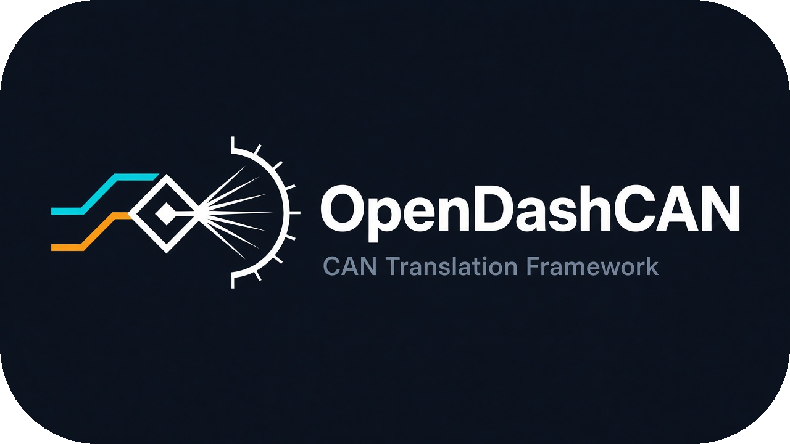
</p>

<h1 align="center">OpenDashCAN</h1>

<p align="center">
  <strong>Installable desktop program (CLI + Qt) for listen-only OBD/CAN sniff, decode, cluster-gap research, and Honda Civic8→Civic10 adaptation documentation.</strong><br/>
  <em>Not a website · Not an ECU flash tool · LISTEN_ONLY by default</em>
</p>

<p align="center">
  <a href="https://pypi.org/project/opendashcan/"></a>
  <a href="LICENSE"></a>
  <a href="pyproject.toml"></a>
  <a href="https://github.com/theworker02/OpenDashCAN/actions/workflows/ci.yml"></a>
  
  
  
  <a href="docs/"></a>
  <a href="CONTRIBUTING.md"></a>
</p>

> **Disclaimer:** Not affiliated with, endorsed by, or sponsored by Honda Motor Co., Ltd.  
> **Honda®, the Honda logo, and related marks are trademarks and/or copyrighted works of Honda Motor Co., Ltd. All rights reserved.**  
> OpenDashCAN does not claim ownership of those marks and does not redistribute official Honda trademark artwork in this repository. See [`docs/TRADEMARKS.md`](docs/TRADEMARKS.md). This project does **not** claim cluster control / physical compatibility.

---

## What it is

**OpenDashCAN Desktop** stays on your PC. It reads vehicle CAN somehow (USB adapter, listen-only Pi recorder, or offline log), decodes **registered** layouts, and surfaces VehicleState, ID rates, Phase‑4 cluster gaps, adaptation plans, wiring checklists, and research docs.

```text
OBD/CAN sniff (LISTEN_ONLY) → registered decoder → VehicleState + ID rates + gaps
```

Offline research pipeline (EncodeMode.NO_OUTPUT by default):

```text
Source Honda CAN → Decoder → VehicleState → ClusterEnvironment → Target Encoder → Donor Cluster
```

Reference adaptation: **2009 Civic (8th gen, R18 auto)** → **10th-gen Civic digital cluster**  
(`honda.civic.gen8.us.r18.auto` → `honda.civic.gen10.cluster.digital`).

**Donor vehicle protocol (2016+ Honda)** is substantially documented from MIT [commaai/opendbc](https://github.com/commaai/opendbc) (`VEHICLE_PROTOCOL_DOCUMENTED`). That is **not** cluster RX confirmation — donor gauge requirements, timing, and gateway behavior remain incomplete until captures and bench tests exist.

**No real vehicle captures are in this repo yet** — only labeled `SYNTHETIC` fixtures for software tests.

---

## Features

| Area | What you get |
|------|----------------|
| **CLI** | `opendashcan` — listen, plan, gaps, registry, DBC index, coverage |
| **Qt desktop** | Dark automotive UI — Live, Platform, Lookup, Gaps, Adaptation, **Wiring**, Research |
| **Live listen** | Virtual / capture replay / SocketCAN·PCAN·slcan — **LISTEN ONLY — NO TRANSMIT** banner |
| **Boot splash** | Honda-themed cluster ignition (not OpenDashCAN logo); trademark notice on splash/About; `--no-splash` / `OPENDASHCAN_NO_SPLASH=1` |
| **DBC** | Import/index from public opendbc — never invents encodings; never auto-promotes to cluster RX |
| **Cluster gaps** | Phase 4 eight-axis gap report (DOCUMENTATION_ONLY) |
| **Wiring** | OBD tap pins, conceptual dual-bus (FUTURE/NO TX), harness switch checklist with confidence labels |
| **Evidence** | GitHub issue form — do not invent CAN data |

---

## Screenshots

<p align="center">
  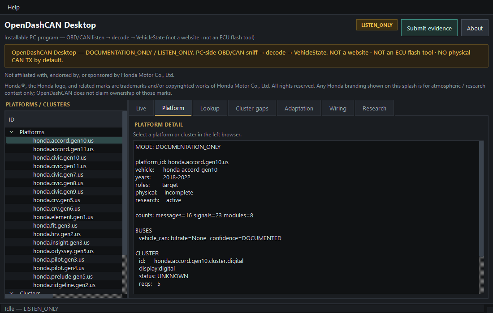<br/>
  <em>Platforms / clusters browser + platform detail</em>
</p>

<p align="center">
  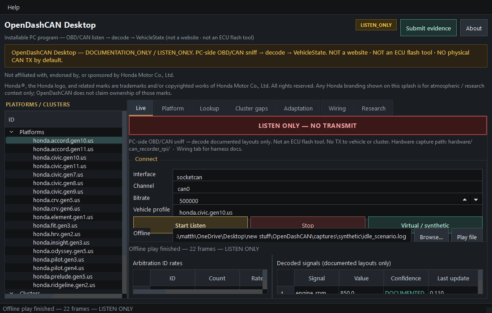<br/>
  <em>Live tab — virtual/offline listen, ID rates, decoded signals, LISTEN ONLY banner</em>
</p>

<p align="center">
  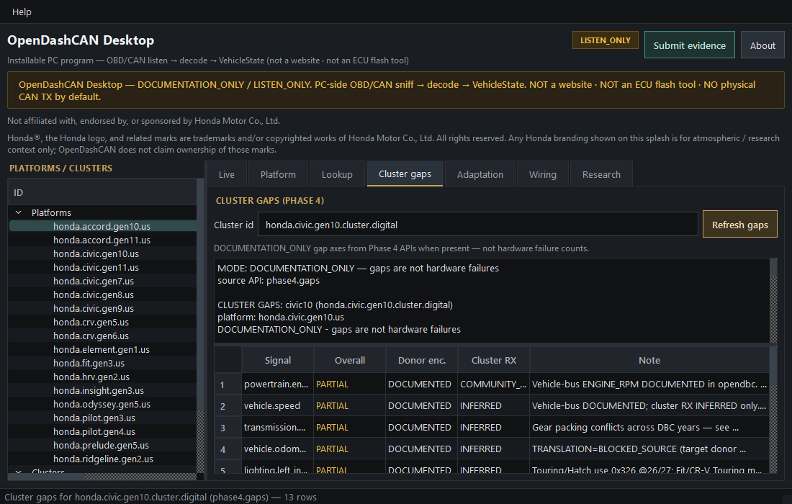<br/>
  <em>Cluster gaps (Phase 4) — documentation-only axes</em>
</p>

<p align="center">
  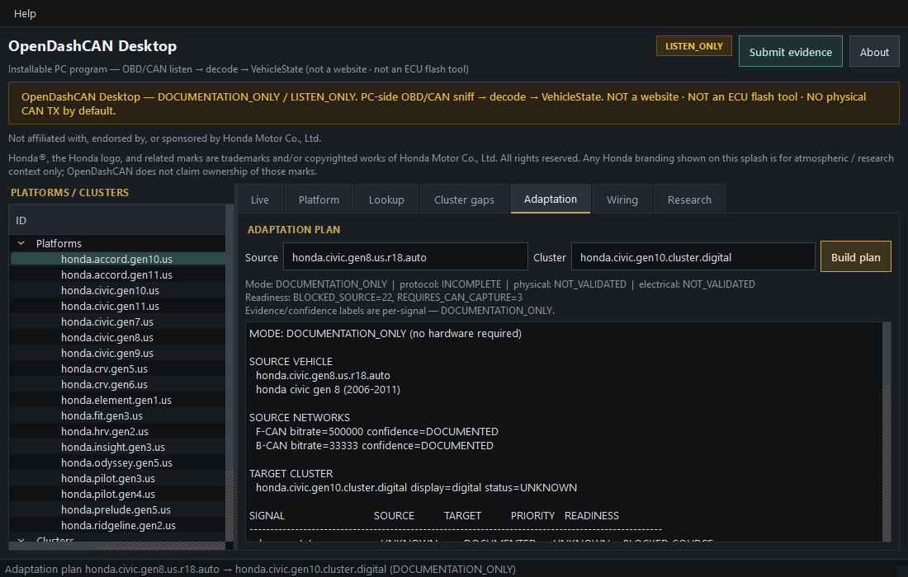<br/>
  <em>Adaptation plan Civic8 → Civic10</em>
</p>

<p align="center">
  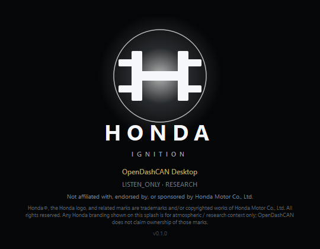<br/>
  <em>Honda-themed boot splash (trademark notice shown; official Honda assets not shipped in git)</em>
</p>

<p align="center">
  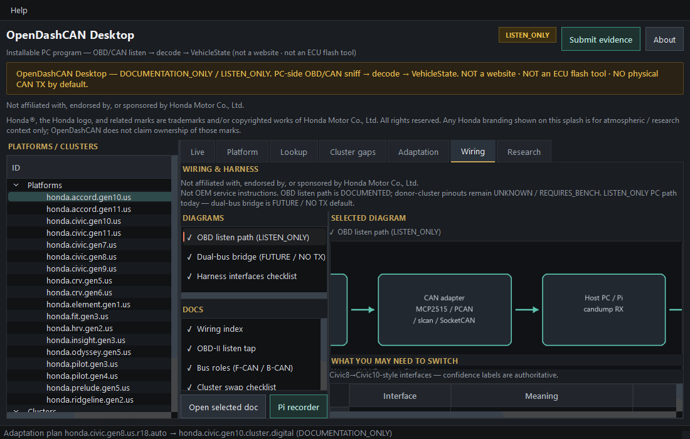<br/>
  <em>Wiring tab — diagrams + harness checklist</em>
</p>

---

## Demo GIFs

<p align="center">
  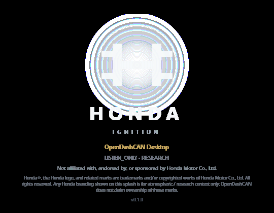<br/>
  <em>Honda-themed boot splash — glow → ready (trademark notice; no official Honda assets in git)</em>
</p>

<p align="center">
  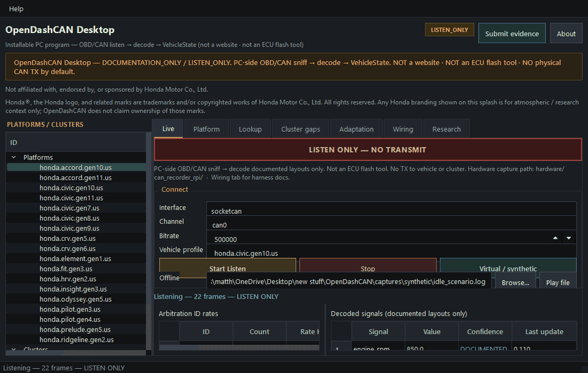<br/>
  <em>Live tab playing synthetic capture (LISTEN_ONLY)</em>
</p>

Regenerate assets:

```bash
python tools/round_brand_assets.py          # rounded logo / banner PNGs
python tools/generate_wiring_diagrams.py
python tools/capture_gui_demo.py --with-splash
```

---

## Install & run

**PyPI:** [opendashcan](https://pypi.org/project/opendashcan/) · **Release:** [v0.1.0](https://github.com/theworker02/OpenDashCAN/releases/tag/v0.1.0)

```bash
# From PyPI — full desktop (CLI + Qt + python-can)
pip install "opendashcan[desktop]"

# From a clone (editable)
pip install -e ".[desktop]"
# or:
pip install -e ".[gui,hw]"

opendashcan info
opendashcan-gui              # splash → main window (Live tab ready)
opendashcan-gui --no-splash  # skip boot animation
opendashcan-listen --virtual
```

**Windows:** after install, `opendashcan` / `opendashcan-gui` are on your Python Scripts PATH. Optional launchers: [`scripts/windows/opendashcan.bat`](scripts/windows/opendashcan.bat), [`scripts/windows/opendashcan-listen.bat`](scripts/windows/opendashcan-listen.bat).

### Live listen (LISTEN_ONLY — no TX)

```bash
opendashcan listen --virtual --vehicle honda.civic.gen10.us
opendashcan listen --capture captures/synthetic/idle_scenario.log
opendashcan listen --interface socketcan --channel can0 --bitrate 500000
opendashcan listen --interface pcan --channel PCAN_USBBUS1
opendashcan listen --interface slcan --channel COM3
```

If `python-can` is missing, the CLI/GUI print a clear install hint; **Virtual** and **Play file** still work.

### Research CLI

```bash
opendashcan registry vehicles
opendashcan plan honda.civic.gen8.us.r18.auto honda.civic.gen10.cluster.digital
opendashcan gaps honda.civic.gen10.cluster.digital
opendashcan build-adapter honda.civic.gen8.us.r18.auto honda.civic.gen10.cluster.digital --documentation-only
opendashcan coverage --write
opendashcan clusters
pytest tests/test_gui_smoke.py
```

---

## Wiring & harness

Evidence-safe docs live under [`docs/wiring/`](docs/wiring/). Diagrams: [`assets/wiring/`](assets/wiring/).

| Doc | Topic |
|-----|--------|
| [OBD listen tap](docs/wiring/obd_listen_tap.md) | Pins 4/5/6/14/16 — AiM / Racelogic / Pi recorder |
| [Bus roles](docs/wiring/bus_roles.md) | F-CAN / B-CAN / gateway conceptual (pin-level UNKNOWN) |
| [Swap checklist](docs/wiring/cluster_swap_checklist.md) | Power, GND, CAN, ignition, illumination, … |

<p align="center">
  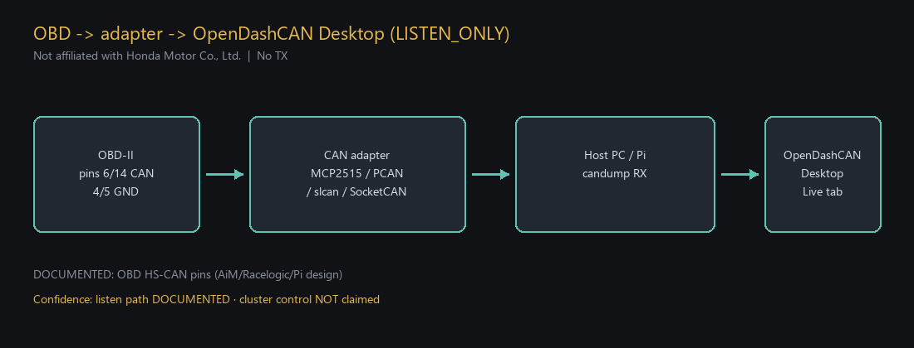<br/>
  <em>OBD → adapter → OpenDashCAN Desktop (LISTEN_ONLY)</em>
</p>

<p align="center">
  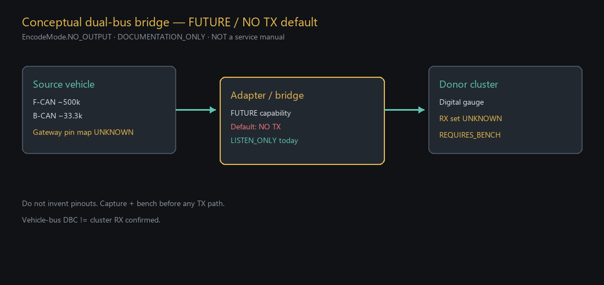<br/>
  <em>Conceptual dual-bus bridge — FUTURE / NO TX default</em>
</p>

<p align="center">
  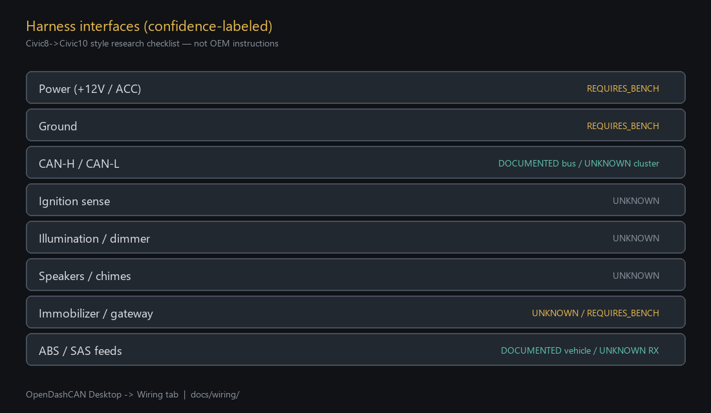<br/>
  <em>Harness interfaces with confidence labels</em>
</p>

In the GUI: open the **Wiring** tab for the same diagrams + checklist, with links to [`hardware/can_recorder_rpi/`](hardware/can_recorder_rpi/README.md).

**Not OEM service instructions.** Donor-cluster connector pinouts are **UNKNOWN / REQUIRES_BENCH** until measured.

---

## Hardware (capture path)

Listen-only Raspberry Pi recorder design: [`hardware/can_recorder_rpi/README.md`](hardware/can_recorder_rpi/README.md) (`candump` → copy log → `opendashcan listen --capture …` or Live tab **Play file**).

**Manufacturing (repo only — not in the Desktop app):** partner note, production BOM/AVL, open CAD (schematic/PCB/harness/OpenSCAD), assembly + ICT/FCT, factory flash, labels — see [`hardware/MANUFACTURING_INDEX.md`](hardware/MANUFACTURING_INDEX.md) and [`hardware/can_recorder_rpi/manufacturing/`](hardware/can_recorder_rpi/manufacturing/).

---

## Safety

- Default: `LinkMode.LISTEN_ONLY` / `EncodeMode.NO_OUTPUT`
- No fabricated CAN IDs, scales, checksums, or pinouts
- Vehicle-bus DBC facts stay `VEHICLE_PROTOCOL_DOCUMENTED` — never auto-promoted to `CLUSTER_RX_CONFIRMED`
- Synthetic fixtures are labeled `SYNTHETIC`
- GUI Live tab always shows **LISTEN ONLY — NO TRANSMIT**

See [docs/safety.md](docs/safety.md).

---

## Evidence & confidence

| Level | Meaning |
|-------|---------|
| `VERIFIED` / `PHYSICALLY_VERIFIED` | Confirmed with cited sources |
| `DOCUMENTED` / `SUPPORTED_BY_MULTIPLE_SOURCES` | Public docs / opendbc agree |
| `COMMUNITY_REPORTED` | Forum / community only |
| `INFERRED` | Heuristic — needs confirmation |
| `UNKNOWN` / `REQUIRES_BENCH` | Default / needs measurement |

**Submit verified evidence** (do not invent CAN data):  
[issue form](https://github.com/theworker02/OpenDashCAN/issues/new?template=evidence_submission.yml) · [guide](docs/submitting-evidence.md) · [policy](docs/evidence-policy.md)

---

## Project layout (high level)

```text
opendashcan/          # Python package (CLI, registry, decode, GUI, hw listen)
opendashcan/gui/      # Qt desktop (Live, gaps, wiring, splash, …)
docs/wiring/          # Harness / OBD / swap checklist
hardware/                 # Pi recorder + manufacturing package (not in PyPI wheel)
assets/               # Official logo, screenshots, demo GIFs, wiring PNGs
captures/synthetic/   # SYNTHETIC fixtures only
research/             # Evidence reports (DOCUMENTATION_ONLY)
```

---

## Contributing

See [CONTRIBUTING.md](CONTRIBUTING.md). Prefer small, evidence-labeled PRs. Never invent encodings or claim cluster RX without captures/bench.

---

## License

**Source-available proprietary** — evaluation under [LICENSE](./LICENSE); commercial / production use via [COMMERCIAL.md](./COMMERCIAL.md). See [LICENSE_TRANSITION_NOTICE.md](./LICENSE_TRANSITION_NOTICE.md) and [NOTICE](./NOTICE).

