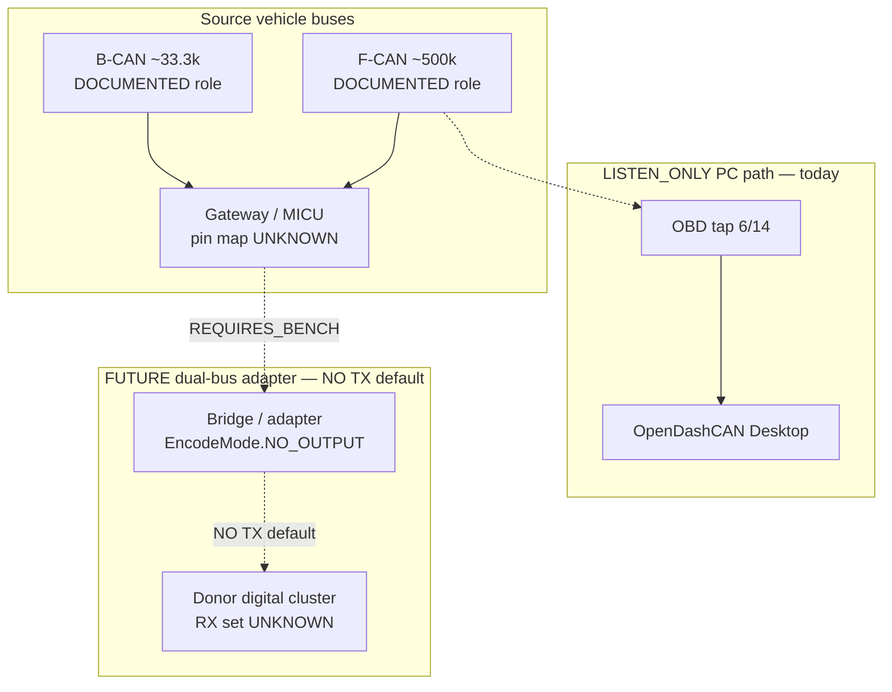

# F-CAN / B-CAN / gauge-gateway (conceptual)

**Confidence:** bus **roles and bitrates** are DOCUMENTED from service-literature summaries already in the registry / adaptation report. **Connector pinouts, splice points, and gateway pin maps for a physical cluster swap are UNKNOWN / REQUIRES_BENCH** until measured.

## Bus roles (Civic research context)

| Bus | Typical rate | Role (high level) | Confidence |
|-----|--------------|-------------------|------------|
| F-CAN | ~500 kbit/s | Powertrain / high-speed vehicle CAN; OBD diagnostic often bridges here | DOCUMENTED (service lit / opendbc vehicle-bus) |
| B-CAN | ~33.3 kbit/s (8th-gen class) | Body / comfort — lighting, some cluster-adjacent signals | DOCUMENTED as bus existence; payload maps largely UNKNOWN |
| Gauge / gateway | UNKNOWN | What a **donor digital cluster** actually requires on the wire | UNKNOWN — not auto-promoted from opendbc |

Community research (e.g. CivicX / B-CAN taps) is labeled `COMMUNITY_RESEARCH` in [`research/CLUSTER_CAN_EVIDENCE.md`](../../research/CLUSTER_CAN_EVIDENCE.md) — not physical verification in this repo.

## Conceptual diagram

## What this does **not** claim

- Exact gauge connector pin numbers for Civic 10 digital clusters
- That OBD traffic alone wakes or drives a donor cluster
- Physical compatibility of any harness splice

See also: [`docs/wiring/cluster_swap_checklist.md`](cluster_swap_checklist.md).
