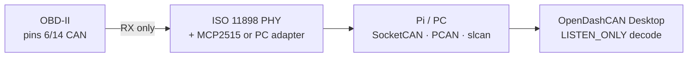

# OBD-II listen-only tap

**Mode:** `LISTEN_ONLY` — receive CAN on the diagnostic connector; do not transmit.

**Disclaimer:** Not Honda service literature. Incorrect wiring can damage the vehicle or adapter. Use a fused tap and a trained technician for vehicle work.

## Standard OBD-II pins used for high-speed CAN listen

Cited from the OpenDashCAN Pi recorder design package and common aftermarket docs (AiM / Racelogic Civic OBD notes referenced in-repo):

| Pin | Function | Listen tap |
|-----|----------|------------|
| 4 | Chassis GND | GND |
| 5 | Signal GND | GND (tie to 4) |
| 6 | CAN-H | CANH |
| 14 | CAN-L | CANL |
| 16 | Battery + | Optional VIN (fused) — prefer dedicated buck for Pi |

Honda Civic diagnostic CAN on OBD is typically **500 kbit/s** (matches Racelogic / AiM Civic OBD documentation cited in `hardware/can_recorder_rpi/README.md`).

## Path to OpenDashCAN Desktop



ASCII:

```text
OBD-II (6=CAN-H, 14=CAN-L, 4/5=GND)
        │  LISTEN ONLY — no TX apps
        ▼
  MCP2515 + SN65HVD230  (or PCAN / slcan / SocketCAN dongle)
        │
        ▼
  candump / python-can RX  →  opendashcan-gui Live tab
```

## Termination

When tapping mid-bus / OBD, the vehicle is already terminated — leave adapter **120 Ω jumpered OFF** (see Pi recorder design).

## Sources in-repo

- [`hardware/can_recorder_rpi/README.md`](../../hardware/can_recorder_rpi/README.md) §3.3 OBD-II pinout
- [`HONDA_ADAPTATION_REPORT.md`](../../HONDA_ADAPTATION_REPORT.md) — OBD channel **names** DOCUMENTED; byte layouts UNKNOWN without public DBC for Civic8 OBD
